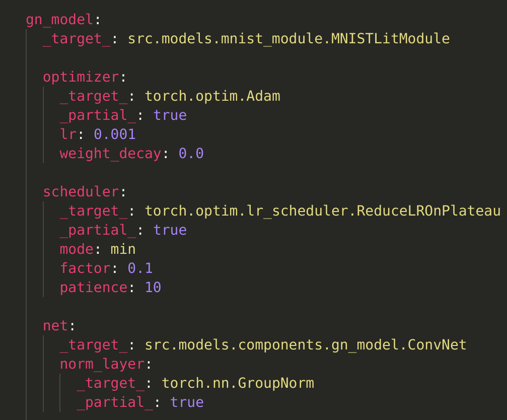
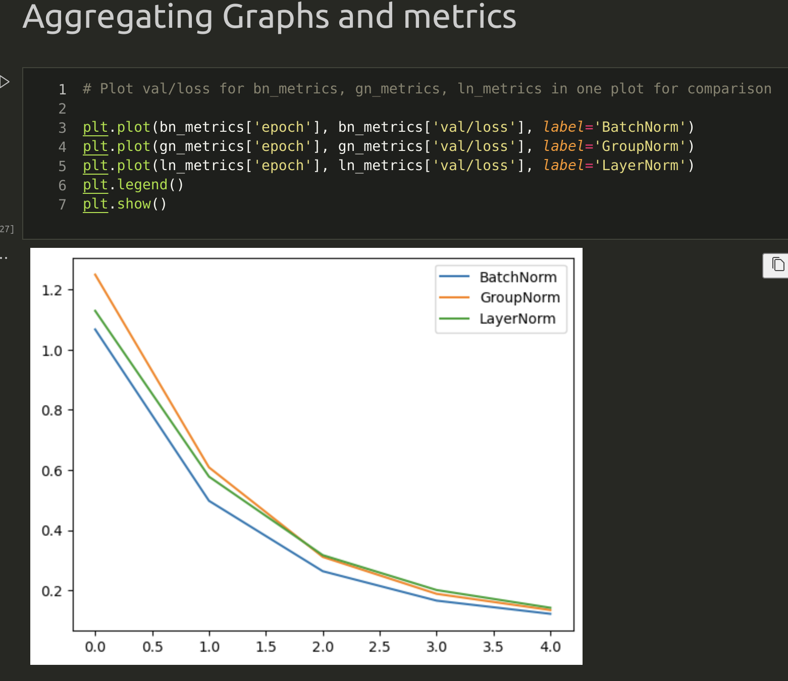
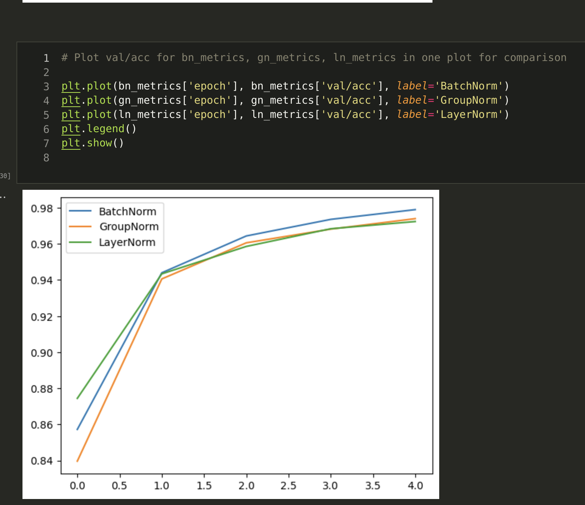
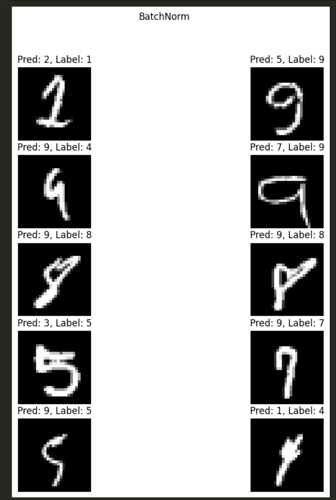
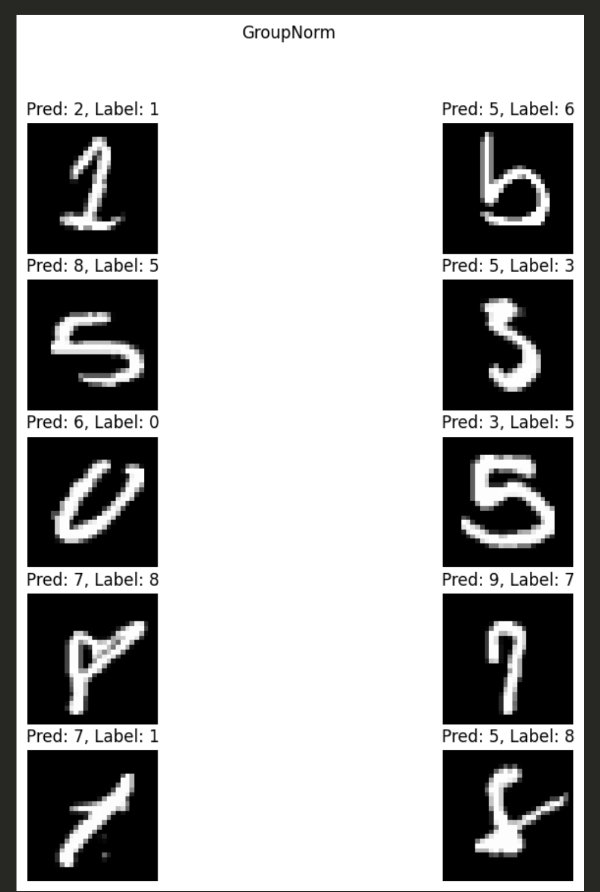
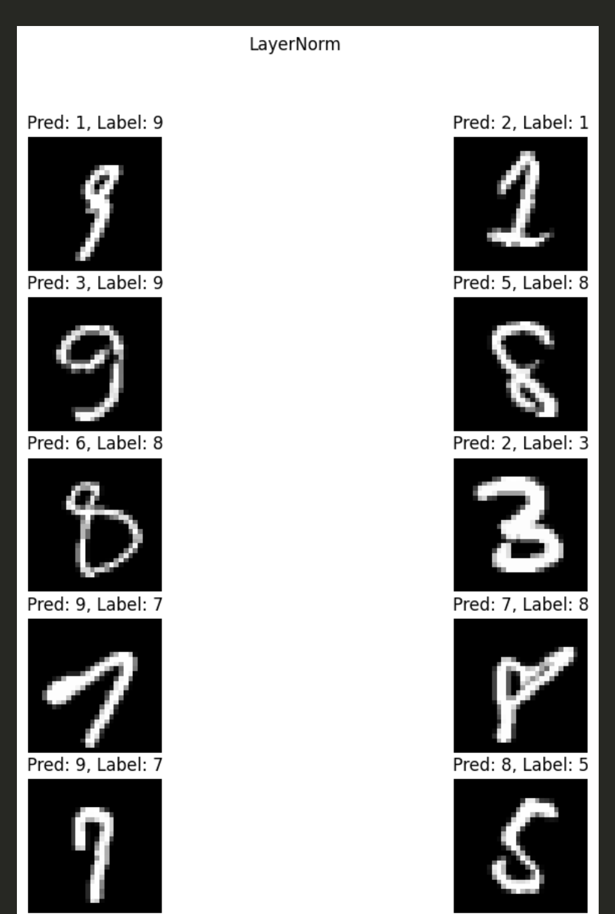

# Sesion 5

* This assignment is based on HYDRA config, all the configs for the models are in the config folder.
* Sample how a model using GroupNorm is initialized

    

* Likewise, we've config for initializing the datamodule, trainer, logger, and callbacks.

    ```
    datamodule = hydra.utils.instantiate(config.datamodule)

    logger = hydra.utils.instantiate(config.csv)


    model_checkpoint = hydra.utils.instantiate(config.model_checkpoint)
    early_stopping = hydra.utils.instantiate(config.early_stopping)


    bn_model = hydra.utils.instantiate(config.bn_model)
    trainer_bn = hydra.utils.instantiate(config.trainer, logger=logger)


    gn_model = hydra.utils.instantiate(config.gn_model)
    trainer_gn = hydra.utils.instantiate(config.trainer, logger=logger)


    ln_model = hydra.utils.instantiate(config.ln_model)
    trainer_ln = hydra.utils.instantiate(config.trainer, logger=logger)
    ```
* The model is trained with separate trainer for each model.

    ```
    trainer_bn.fit(bn_model, datamodule=datamodule)
    trainer_gn.fit(gn_model, datamodule=datamodule)
    trainer_ln.fit(ln_model, datamodule=datamodule)
    ```

* Here are the results for the training

    

    

* Misclassified images
    1. BatchNorm
        
    
    2. GroupNorm
        

    3. LayerNorm
        